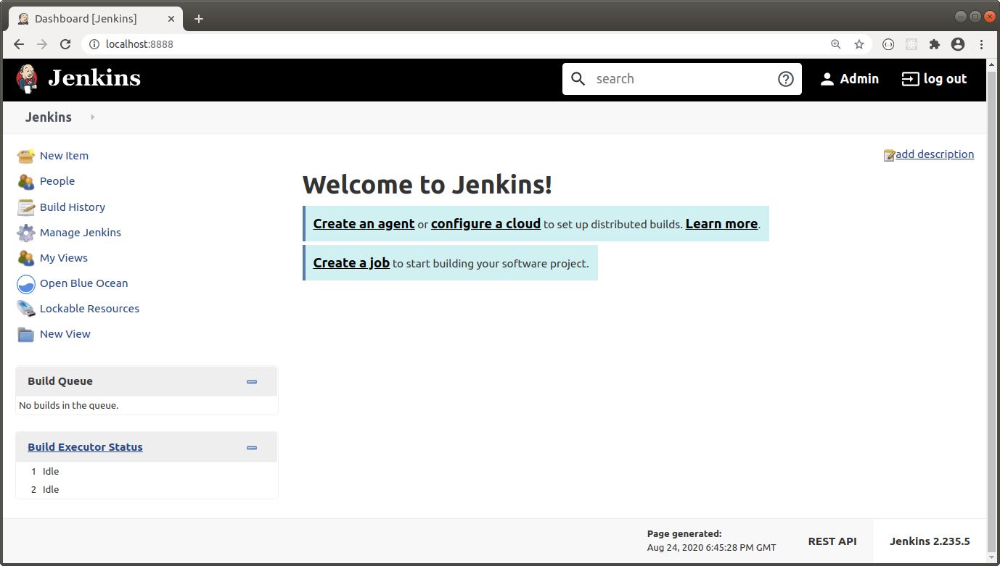
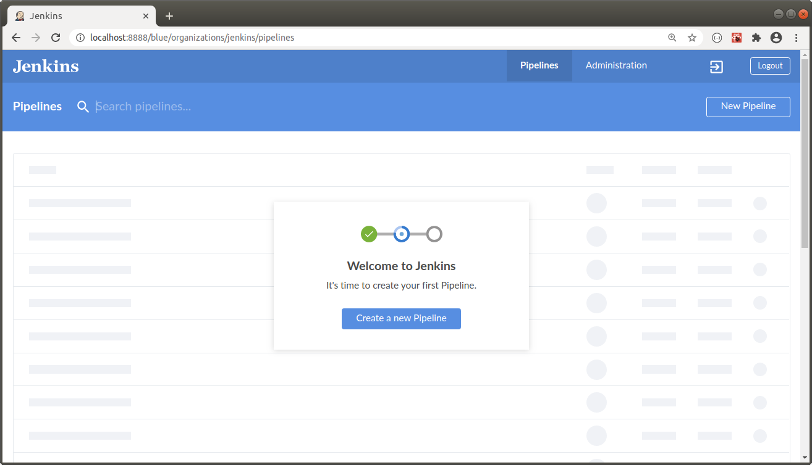

JENKINS
---------------------------------------------------------------------------------------------------------

**Se baja imagen de Jenkins (Blue Ocean):**

```

    docker pull jenkinsci/blueocean

```

**Se levanta contenedor a partir de la imagen anterior:**

```

    docker run -d -p 8888:8080 jenkinsci/blueocean

```

**Para levantar contenedor utilizando un volumen:**

```

    docker run -d -p 8888:8080 -v /local/path:/var/jenkins_home jenkinsci/blueocean

```

**Revisar id del container:**

```

    docker ps

```

**Revisar logs del container para obtener password inicial:**

```

    docker logs <container_id>

```

**Pantalla principal de Jenkins corriendo en el puerto 8888:**




**Vista de Blue Ocean:**




---------------------------------------------------------------------------------------------------------