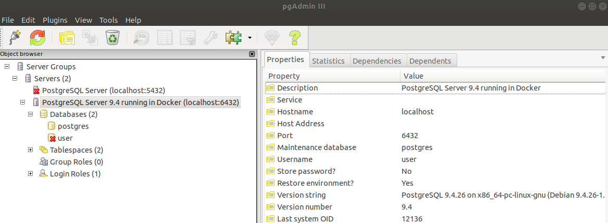

POSTGRESQL
---------------------------------------------------------------------------------------------------------


**Se genera archivo Dockerfile para levantar PostgreSQL dentro de un contenedor:**

```

    FROM postgres:9.4

    ENV POSTGRES_USER=user
    ENV POSTGRES_PASSWORD=pass2020


```

**Se construye imagen a partir de archivo Dockerfile:**

```

    docker build -t postgres_server .

```

**Se levanta contenedor utilizando la imagen generada previamente:**

```

    docker run -d -p 6432:5432 postgres_server

```

---------------------------------------------------------------------------------------------------------

**Conexión a servidor PostgreSQL desde pgAdminIII:**




---------------------------------------------------------------------------------------------------------
