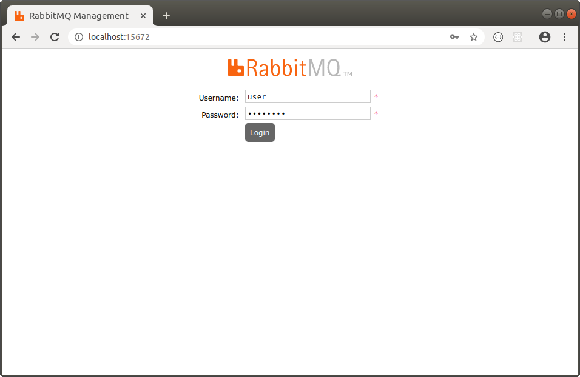
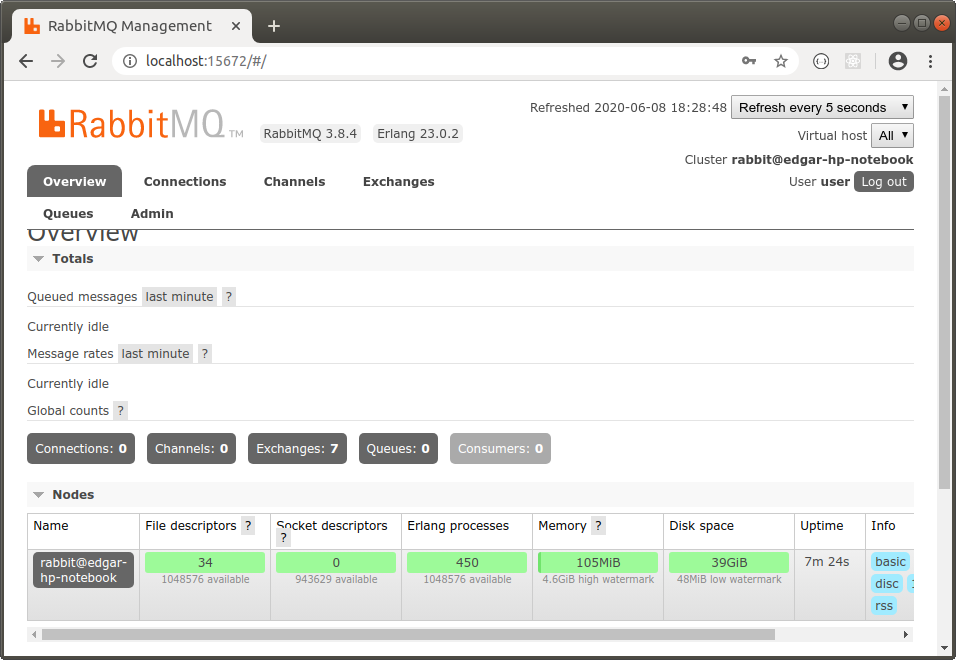

RABBITMQ
---------------------------------------------------------------------------------------------------------

Se baja imagen de RabbitMQ:

```

    docker pull rabbitmq:3-management 

```

Se genera archivo Dockerfile que configura usuario default:

```

    FROM rabbitmq:3-management

    ENV RABBITMQ_DEFAULT_USER=user
    ENV RABBITMQ_DEFAULT_PASS=password


```

Se construye imagen a partir de archivo Dockerfile y se levanta contenedor a partir de la imagen generada:

```
    cd rabbitmq
    
    docker build -t rabbit-server .

    docker run -d --net=host rabbit-server

```

RabbitMQ ejecutándose en el puerto 15672:





---------------------------------------------------------------------------------------------------------