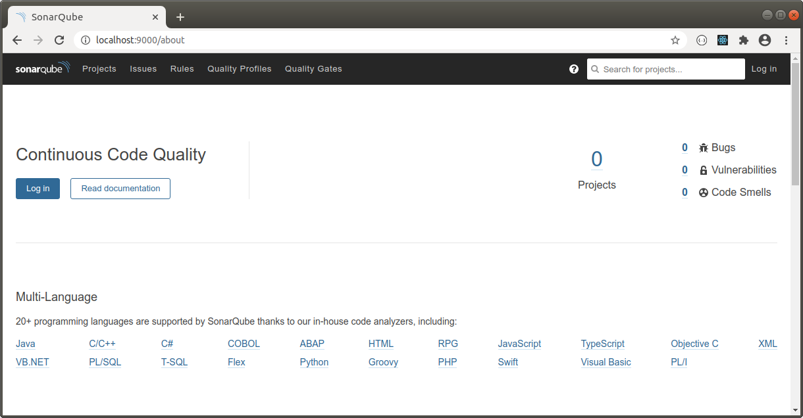

JENKINS
---------------------------------------------------------------------------------------------------------

**Se baja imagen de Sonarqube:**

```

    docker pull sonarqube

```

**Se levanta contenedor a partir de la imagen anterior:**

```

    docker run -d -p 9000:9000 sonarqube

```

**Pantalla principal de Sonarqube corriendo en el puerto 9000:**




---------------------------------------------------------------------------------------------------------